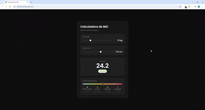

# ⚖️ Calculadora de IMC

<div align="center">
  
</div>

<div align="center">


</div>

---

## 🚀 Sobre o Projeto

Calculadora de IMC (Índice de Massa Corporal) moderna com tema escuro, atualização em tempo real via sliders e escala visual de referência. Desenvolvida com HTML, CSS e JavaScript puro — sem dependências externas.

---

## ✨ Funcionalidades

- 🎚️ Sliders interativos para peso e altura
- 📊 Resultado atualizado em tempo real
- 🎨 Badge colorido por categoria (Abaixo do peso, Normal, Sobrepeso, Obesidade)
- 📍 Marcador animado na escala de referência
- 🌑 Tema dark moderno
- 📱 Totalmente responsivo

---

## 📐 Categorias de IMC

| Categoria | IMC |
|---|---|
| 🔵 Abaixo do peso | menor que 18.5 |
| 🟢 Normal | 18.5 – 24.9 |
| 🟡 Sobrepeso | 25.0 – 29.9 |
| 🔴 Obesidade | maior que 30 |

---

## 🛠️ Tecnologias

| Tecnologia | Uso |
|---|---|
| **HTML5** | Estrutura da página |
| **CSS3** | Estilização, dark theme e responsivo |
| **JavaScript** | Cálculo do IMC e interatividade |
| **Google Fonts** | Tipografia (Poppins) |

---

## 📁 Estrutura do projeto

```
calculadora-imc/
├── assets/
│   └── demo.gif     # GIF de demonstração
├── index.html       # Estrutura da página
├── style.css        # Estilos e responsivo
├── script.js        # Lógica da calculadora
└── README.md        # Este arquivo
```

---

## 🖥️ Como usar

1. Clone o repositório:
```bash
git clone https://github.com/guilherme-ed/calculadora-imc.git
```

2. Abra o arquivo `index.html` no navegador — não precisa de servidor!

---

## 📄 Licença

MIT License — sinta-se livre para usar e modificar.

---

<div align="center">
  Feito com 💚 usando HTML + CSS + JavaScript
</div>
